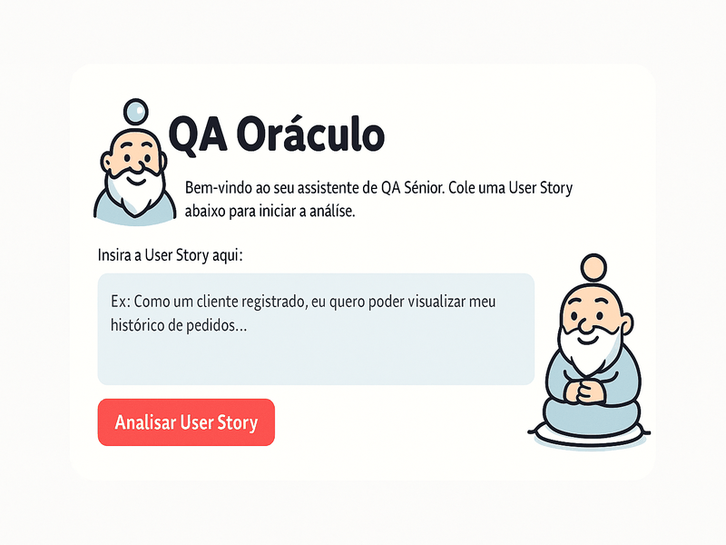

# 🔮 QA Oracle

  

<i>Requirements Analysis with Artificial Intelligence</i>

  
  
  
  

---
<nav aria-label="Language switcher" style="text-align: right;">
<a href="README-en.md" aria-current="page">🇺🇸 <strong>English</strong></a> |
<a href="README.md">🇧🇷 Português</a>
</nav>

---

## 🚀 Why use QA Oracle?

Tired of **vague User Stories** and **endless meetings** to align understanding?

**QA Oracle** transforms loose requirements into **ready-to-test specifications** powered by AI.

👉 In just **minutes**, you’ll get:
- ✅ Clear acceptance criteria  
- ❓ Smart questions for the PO  
- 📝 Complete and organized test plans  
- 🧪 On-demand Gherkin scenarios  
- 📄 Exportable reports (.md, .pdf, .xlsx)  

It’s like having a **Senior QA available 24/7**, accelerating planning and reducing failures before the first bug even appears.

---

## 📸 Interface Preview

---

## 🚀 Key Features

- 💻 **Interactive Web Interface** (Streamlit).  
- 📝 **Editable & Interactive Analysis**: refine AI output with human validation.  
- 🔍 **Ambiguity detection** and suggested questions for the PO.  
- ✅ **Objective and verifiable acceptance criteria** generation.  
- 📊 **Interactive Test Case Table**.  
- 📥 **Multiple export options** (`.md`, `.pdf`, Azure, Jira).  
- 📖 **Analysis history** with selective deletion.  
- 🏗️ **Modular, optimized, and fully tested code**.  

---

## 🛠️ Technologies Used

- 🐍 Python 3.11+  
- 🌐 Streamlit (web framework)  
- 🧠 LangGraph & Google Gemini (AI orchestration)  
- 📊 Pandas  
- 📄 FPDF2 (PDF generation)  
- 📈 Openpyxl (Excel manipulation)  

---

## ⚙️ Running Locally

### 📌 Prerequisites
- Python 3.11+  
- Google API Key ([get it here](https://console.cloud.google.com))  

### 🚀 Installation
\`\`\`bash
# Clone the repository
git clone https://github.com/joprestes/qa-oraculo-requisitos.git
cd qa-oraculo-requisitos

# Create and activate virtual environment
python3 -m venv venv
source venv/bin/activate  # Mac/Linux
# .\venv\Scripts\activate  # Windows

# Install dependencies
pip install -r requirements.txt
pip install -r requirements-dev.txt  # For testing and dev tools
\`\`\`

### 🔑 API Configuration
Create a `.env` file at the project root:
\`\`\`env
GOOGLE_API_KEY="your_api_key_here"
\`\`\`

### ▶️ Run
\`\`\`bash
streamlit run app.py
\`\`\`

🎉 QA Oracle will automatically open in your browser!

---

## 📋 How to Use

1. **Insert the User Story** in the input field.  
2. Click **“Analyze User Story”**.  
3. **Review and edit** the analysis generated by the AI.  
4. Choose whether to generate the **detailed test plan** or finish.  
5. **Export results** to `.md`, `.pdf`, `.xlsx`, Azure or Jira.  
6. Manage the **analysis history** (delete one or clear all).  
7. Click **“New Analysis”** to start fresh.  

### 🔎 Practical Example
**Input:**  
\`\`\`
As a banking app user,
I want to reset my password via email,
so that I can recover access if I forget it.
\`\`\`

**Generated Output:**  
- Acceptance Criteria:
  - Reset link is sent within 1 minute.  
  - The link expires in 24h.  
  - New password must have at least 8 characters including letters and numbers.  

- Questions for PO:
  - How many hours should the reset link remain valid?  
  - Is there a daily limit for reset attempts?  

- Gherkin Scenario:
  \`\`\`gherkin
  Scenario: Successfully reset password
    Given the user provided a valid email
    When they request a password reset
    Then they receive a valid reset link that expires in 24h
  \`\`\`

---

## 🤔 Troubleshooting

❌ **Error: Invalid API Key**  
✔️ Check your `.env` file and ensure the “Generative Language” API is enabled in Google Cloud.  

❌ **Error: command \`streamlit\` not found**  
✔️ Make sure your `venv` virtual environment is activated.  

---

## 🧪 Quality and Testing

- **Coverage ≥97%** with \`pytest\`.  
- **New tests** ensure history cleanup works properly.  

\`\`\`bash
pytest
pytest --cov
\`\`\`

Centralized configuration in \`pyproject.toml\`:  
- `black` (line length: 88)  
- `pytest` with coverage and warnings disabled  

---

## 📌 Roadmap

- [x] Web interface with Streamlit  
- [x] Export to `.md`, `.pdf`, Azure, Jira  
- [x] Analysis history with selective deletion  
- [ ] **Containerize with Docker**  

---

## 🤝 Contributing

Contributions are welcome!  
- Open an **issue** for bugs or feature requests.  
- Submit a **Pull Request** with new functionality.  

⭐ If this project helped you, don’t forget to leave a **star**!

---

## 📜 License

This project is licensed under **CC BY-NC 4.0**.  
**Personal and academic use allowed**, **commercial use strictly prohibited**.  

Read more at [Creative Commons](https://creativecommons.org/licenses/by-nc/4.0/).