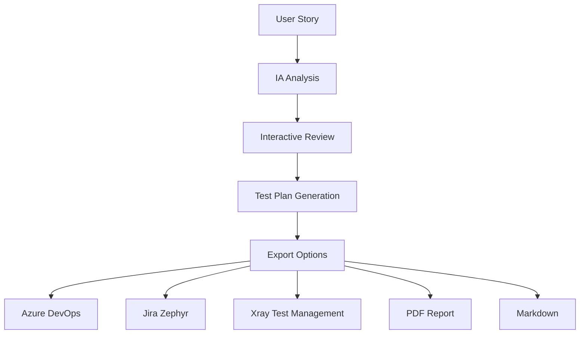

<div align="center">

# 🔮 QA Oráculo

**Ferramenta de análise inteligente de User Stories com geração automática de planos de teste e cenários Gherkin**

[](https://python.org)
[](https://streamlit.io)
[](https://creativecommons.org/licenses/by-nc/4.0/)
[](#-testes)

*Transforme User Stories em planos de teste estruturados com o poder da IA*

</div>

---

## 🎯 O que é o QA Oráculo?

O **QA Oráculo** é uma ferramenta revolucionária que utiliza **Inteligência Artificial** para analisar User Stories e gerar automaticamente:

- 📋 **Análises detalhadas** de requisitos
- 🎯 **Critérios de aceite** estruturados  
- 🧪 **Cenários de teste** em formato Gherkin
- 📊 **Planos de teste** completos
- 📥 **Exportações** para suas ferramentas favoritas

### 🚀 Por que usar?

- ⚡ **Rápido**: Análise completa em segundos
- 🎯 **Preciso**: IA treinada especificamente para QA
- 🔧 **Flexível**: Edite e refine os resultados
- 📤 **Integrado**: Exporte para Azure, Jira, Xray e mais
- ♿ **Acessível**: Interface WCAG 2.1 Level AA

---

## ⚡ Instalação Super Rápida

### 🎯 Opção 1: Setup Automático (Recomendado)

**Windows:**
```bash
scripts/quick-setup.bat
```

**Linux/Mac:**
```bash
./scripts/quick-setup.sh
```

### 🔧 Opção 2: Setup Manual

```bash
# 1. Clone o repositório
git clone https://github.com/seu-usuario/qa-oraculo.git
cd qa-oraculo/qa-oraculo-requisitos

# 2. Instale as dependências
pip install -r requirements.txt

# 3. Configure sua API Key
echo 'GOOGLE_API_KEY="sua_chave_aqui"' > .env

# 4. Execute o aplicativo
streamlit run main.py
```

### 🛠️ Comandos de Desenvolvimento

```bash
# Setup completo
make setup

# Executar aplicação
make run

# Executar testes
make test

# Verificar qualidade
make dev-check

# Ver todos os comandos
make help
```

> **💡 Dica**: Para instruções detalhadas e troubleshooting, veja nosso [**Guia Completo de Instalação**](docs/SETUP_GUIDE.md)

---

## 🎬 Demonstração

<div align="center">

### Como funciona em 3 passos:

**1️⃣ Cole sua User Story**  
**2️⃣ Revise a análise da IA**  
**3️⃣ Exporte para suas ferramentas**

</div>

---

## ✨ Funcionalidades Principais

### 🤖 Análise Inteligente com IA
- **Análise de ambiguidades** em User Stories
- **Identificação de riscos** e dependências
- **Sugestão de perguntas** para o Product Owner
- **Geração de critérios de aceite** estruturados

### ✏️ Edição Interativa
- **Revise e refine** os resultados da IA
- **Adicione suas próprias observações**
- **Personalize critérios** de aceite
- **Ajuste cenários** de teste

### 🧪 Geração de Cenários Gherkin
- **Cenários estruturados** em formato Given-When-Then
- **Cobertura completa** dos critérios de aceite
- **Priorização automática** de cenários
- **Justificativas de acessibilidade** incluídas

### 📥 Exportação Multi-Plataforma

| Ferramenta | Formato | Status |
|------------|---------|--------|
| **Markdown** | `.md` | ✅ |
| **PDF** | `.pdf` | ✅ |
| **Azure DevOps** | `.csv` | ✅ |
| **Jira Zephyr** | `.xlsx` | ✅ |
| **Xray Test Management** | `.csv` | 🆕 |

### 📖 Histórico e Gestão
- **Salve análises** para referência futura
- **Visualize histórico** completo
- **Exclua análises** individuais ou em lote
- **Busque análises** anteriores

---

## 🆕 Destaque: Exportação Xray

Exporte seus cenários Cucumber diretamente para o **Xray (Jira Test Management)**:

### ✨ Recursos Exclusivos
- ✅ **CSV compatível** com Xray Test Case Importer
- ✅ **Campos personalizados** (Labels, Priority, Component, etc.)
- ✅ **Campos customizados** ilimitados
- ✅ **Test Repository Folder** configurável
- ✅ **Preservação de formatação** Gherkin

### 📚 Guia Completo
Veja nosso [**Guia de Exportação Xray**](docs/XRAY_EXPORT_GUIDE.md) para instruções detalhadas.

---

## 🧪 Testes e Qualidade

### Executar Testes
```bash
# Todos os testes
pytest

# Com cobertura de código
pytest --cov

# Teste específico
pytest tests/test_xray_export.py
```

### Verificar Qualidade
```bash
# Lint
ruff check .

# Formatação
black --check .
```

### 📊 Cobertura de Testes
- **90%+ de cobertura** garantida
- **Testes automatizados** em CI/CD
- **Validação contínua** de qualidade

---

## 🏗️ Arquitetura

<div align="center">



</div>

### 🧩 Componentes Principais
- **`qa_core/app.py`** - Interface Streamlit
- **`qa_core/graph.py`** - Grafos de IA (LangGraph)
- **`qa_core/database.py`** - Persistência SQLite
- **`qa_core/utils.py`** - Utilitários e exportações
- **`qa_core/a11y.py`** - Recursos de acessibilidade

---

## 📚 Documentação

| Documento | Descrição |
|-----------|-----------|
| [**docs/SETUP_GUIDE.md**](docs/SETUP_GUIDE.md) | Guia completo de instalação |
| [**docs/DEVELOPER_QUICK_START.md**](docs/DEVELOPER_QUICK_START.md) | Guia para desenvolvedores |
| [**docs/README.md**](docs/README.md) | Documentação técnica completa |
| [**docs/XRAY_EXPORT_GUIDE.md**](docs/XRAY_EXPORT_GUIDE.md) | Guia de exportação Xray |
| [**docs/CHANGELOG.md**](docs/CHANGELOG.md) | Histórico de mudanças |
| [**docs/acessibilidade.md**](docs/acessibilidade.md) | Guia de acessibilidade |

---

## 🤝 Contribuindo

Contribuições são muito bem-vindas! Veja nosso [**Guia de Contribuição**](docs/DEVELOPER_QUICK_START.md) para:

- 🚀 Setup de desenvolvimento
- 📝 Padrões de código
- 🧪 Execução de testes
- 📋 Processo de contribuição

### 🎯 Como Contribuir
1. **Fork** o repositório
2. **Crie** uma branch: `git checkout -b feature/nova-funcionalidade`
3. **Commit** suas mudanças: `git commit -m "feat: adiciona nova funcionalidade"`
4. **Push** para a branch: `git push origin feature/nova-funcionalidade`
5. **Abra** um Pull Request

---

## 📄 Licença

Este projeto está licenciado sob a [**CC BY-NC 4.0**](https://creativecommons.org/licenses/by-nc/4.0/) - Uso pessoal e acadêmico permitido.

---

## 👨‍💻 Desenvolvido com 💜

**Joelma Prestes Ferreira**

*QA Engineer & AI Enthusiast*

---

<div align="center">

### 🚀 Pronto para revolucionar sua análise de User Stories?

**[Comece agora →](docs/SETUP_GUIDE.md)**

</div>