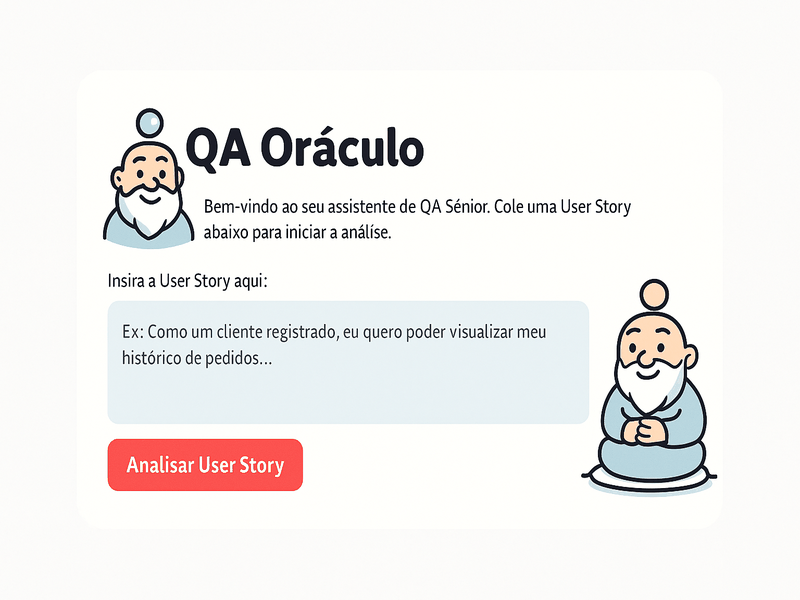

<p align="center">
  
</p>

<h1 align="center">🔮 QA Oráculo</h1>
<p align="center"><i>Análise de Requisitos com Inteligência Artificial</i></p>

<p align="center">
  
  
  
  
</p>

<nav aria-label="Language switcher" style="text-align: right;">
<a href="README-en.md">🇺🇸 English</a> |
<a href="README.md" aria-current="page">🇧🇷 <strong>Português</strong></a>
</nav>

## 🚀 Por que usar o QA Oráculo?

Cansou de **User Stories vagas** e **reuniões intermináveis** para alinhar entendimentos?

O **QA Oráculo** transforma requisitos soltos em **especificações prontas para teste** usando IA de ponta.

👉 Em **minutos**, você terá:
- ✅ Critérios de aceite objetivos  
- ❓ Perguntas inteligentes para o PO  
- 📝 Planos de teste completos e organizados  
- 🧪 Cenários em Gherkin sob demanda  
- 📄 Relatórios exportáveis (.md, .pdf, .xlsx)  

É como ter um **QA Sênior disponível 24/7**, acelerando o planejamento e reduzindo falhas antes mesmo do primeiro bug aparecer.

---

## 📸 Preview da Interface



---

## 🚀 Principais Funcionalidades

| 🔧 Recurso | 💡 Descrição |
|------------|--------------|
| 💻 **Interface Web** | Construída com Streamlit, intuitiva e interativa |
| 🔍 **Detecção de Ambiguidades** | Sugere perguntas inteligentes para o PO |
| ✅ **Critérios de Aceite** | Objetivos, verificáveis e claros |
| 📝 **Planos de Teste & Gherkin** | Casos de teste sob demanda |
| 📊 **Tabela Interativa** | Casos de teste navegáveis via Pandas |
| 📥 **Exportações Múltiplas** | .md, .pdf, .xlsx (Azure DevOps, Jira Zephyr) |
| 🔄 **Fluxo Flexível** | Gere planos completos ou apenas análise inicial |
| 🏗️ **Arquitetura Modular** | Código refatorado para fácil expansão |

---

## 🛠️ Tecnologias Utilizadas

- 🐍 Python 3.11+  
- 🌐 Streamlit (Framework da Interface Web)  
- 🧠 LangGraph & Google Gemini (Orquestração e IA)  
- 📊 Pandas (Manipulação de Dados)  
- 📄 FPDF2 (Geração de Relatórios em PDF)  
- 📈 Openpyxl (Manipulação de arquivos Excel .xlsx)  

---

## ⚙️ Como Executar Localmente

<details>
<summary><b>📌 Pré-requisitos</b></summary>

- Python 3.11+  
- Chave de API do Google (obtenha [aqui](https://console.cloud.google.com))  

</details>

<details>
<summary><b>🚀 Instalação</b></summary>

```bash
# Clone o repositório
git clone https://github.com/joprestes/qa-oraculo-requisitos.git
cd qa-oraculo-requisitos

# Crie e ative o ambiente virtual
python3 -m venv venv
source venv/bin/activate  # Mac/Linux
# .\venv\Scripts\activate  # Windows

# Instale as dependências
pip install -r requirements.txt
```
</details>

<details>
<summary><b>🔑 Configuração da API</b></summary>

Crie um arquivo `.env` na raiz do projeto:

```env
GOOGLE_API_KEY="sua_chave_de_api_aqui"
```
</details>

<details>
<summary><b>▶️ Executar</b></summary>

```bash
streamlit run app.py
```

🎉 O QA Oráculo abrirá no navegador automaticamente!
</details>

---

## 📋 Como Usar

1. **Insira a User Story** → Cole a User Story que deseja analisar.  
2. **Inicie a Análise** → Clique em "Analisar User Story" para receber o relatório inicial.  
3. **Decida o Próximo Passo** → Escolha entre gerar o plano de testes detalhado ou encerrar a análise.  
4. **Exporte os Resultados** → Use os botões de download. Para Azure/Jira, configure os campos customizáveis.  
5. **Comece de Novo** → Clique em "Realizar Nova Análise" para reiniciar o ciclo.  

---

## 🤔 Solução de Problemas

❌ **Erro:** API Key inválida  
✔️ Confirme se o arquivo `.env` está na raiz e se a API “Generative Language” está ativa no Google Cloud.  

❌ **Erro:** comando `streamlit` não encontrado  
✔️ Certifique-se de que o ambiente virtual `venv` está ativado.  

---

## 📌 Roadmap

- [x] Interface web interativa com Streamlit  
- [x] Geração de critérios de aceite e perguntas ao PO  
- [x] Geração de plano de testes sob demanda  
- [x] Exportação em .md e .pdf  
- [x] Exportação para Azure DevOps (.xlsx)  
- [x] Exportação para Jira Zephyr (.xlsx)  
- [x] Refatoração para arquitetura modular  
- [ ] Caching de resultados para otimizar chamadas de API  
- [ ] Implementar suíte de testes com pytest  
- [ ] Externalizar prompts em `config.yaml`  
- [ ] Edição interativa da análise inicial pelo usuário  

---

## 🤝 Contribuição

Contribuições são muito bem-vindas!  
- Abra uma **issue** para reportar bugs ou sugerir melhorias  
- Envie um **Pull Request** com novas funcionalidades  

⭐ Se este projeto te ajudou, não esqueça de deixar uma **estrela no repositório**!
