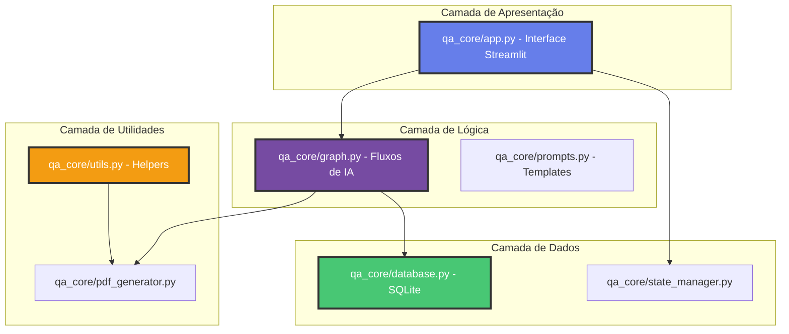

# 🧠 Documentação Técnica – QA Oráculo

[](https://github.com/joprestes/qa-oraculo-requisitos/actions/workflows/ci.yml)  
[](https://github.com/joprestes/qa-oraculo-requisitos)

## 📚 Sumário

- [⚙️ Integração Contínua (CI)](#-integração-contínua-ci)
- [🧰 Scripts de Setup](#-scripts-de-setup)
- [🧩 Estrutura de Código](#-estrutura-de-código)
- [🏗 Arquitetura Interna](#-arquitetura-interna)
- [🧪 Testes e Qualidade](#-testes-e-qualidade)
- [🧱 Convenções de Código](#-convenções-de-código)
- [🧩 Boas Práticas](#-boas-práticas)
- [🧱 Planejamento de Evolução](#-planejamento-de-evolução)
- [⚙️ Ambiente de Execução](#-ambiente-de-execução)
- [🛠️ Configuração e Orquestração da IA](#-configuração-e-orquestração-da-ia)
- [📦 Validação e Schemas](#-validação-e-schemas)
- [🔒 Segurança e Privacidade](#-segurança-e-privacidade)
- [💡 Créditos Técnicos](#-créditos-técnicos)
- [📆 Histórico de Versões](#-histórico-de-versões)

---

## ⚙️ Integração Contínua (CI)

Arquivo: `.github/workflows/ci.yml`

### Etapas
1. Checkout do repositório  
2. Setup Python (3.11–3.13)  
3. Cache do pip  
4. Instala dependências e ferramentas de qualidade  
5. Lint (Black) e Ruff  
6. Testes e cobertura (`pytest --cov`)  
7. Gate de cobertura ≥ 90 %  
8. Validação do `pyproject.toml`

---

## 🧰 Scripts de Setup

### setup.sh (Linux/Mac)
- Criação de `.venv`
- Instalação de dependências
- Lint, formatação e testes automáticos
- Validação de `pyproject.toml`

### setup.bat (Windows)
Fluxo equivalente para o shell do Windows.

---

## 🧩 Estrutura de Código

```text
qa-oraculo-requisitos/
├── qa_core/
│   ├── app.py             # Interface Streamlit + camada de orquestração
│   ├── config.py          # Configurações, variáveis de ambiente e feature flags
│   ├── database.py        # Persistência (SQLite + helpers de histórico)
│   ├── graph.py           # Fluxos de IA (LangGraph + Gemini)
│   ├── pdf_generator.py   # Geração de relatórios PDF
│   ├── prompts.py         # Prompt base e templates dinâmicos
│   ├── schemas.py         # Schemas Pydantic (contratos de entrada/saída)
│   ├── state_manager.py   # Estado da sessão e resets controlados
│   └── utils.py           # Funções auxiliares e exportações (CSV/XLSX)
├── assets/                # Logos, ícones e arquivos estáticos
└── tests/                 # Testes unitários e de integração leve
```

---

## 🏗 Arquitetura Interna



- `qa_core/app.py`: porta de entrada com Streamlit, integração de IA e exportações.
- `qa_core/config.py`: resolve variáveis de ambiente, chaves externas e toggles de recursos.
- `qa_core/graph.py`: centraliza o fluxo de raciocínio da IA com LangGraph.
- `qa_core/prompts.py`: mantém prompts versionados para análise e plano de testes.
- `qa_core/database.py`: persistência local e caching leve para histórico de análises.
- `qa_core/state_manager.py`: abstrai o estado da sessão e resets seguros.
- `qa_core/pdf_generator.py`: exportação de relatórios formatados em PDF.
- `qa_core/schemas.py`: contratos Pydantic que validam dados trocados entre módulos.
- `qa_core/utils.py`: funções auxiliares para formatação, exportação e normalizações.

---

## 🧪 Testes e Qualidade

- Framework: **Pytest**  
- Banco de testes: **SQLite in-memory**  
- Cobertura mínima: **90 % (meta: 97 %)**  
- Execução:
  ```bash
  pytest --cov --cov-report=term-missing
  ```

### Pirâmide de testes implementada

- **Unitários:** `tests/test_utils.py`, `tests/test_state_manager.py`, `tests/test_pdf_generator.py`.
- **Integração leve:** `tests/test_app.py`, `tests/test_app_main.py`, `tests/test_graph.py`.
- **Contratos:** `tests/tests_schemas.py` valida schemas e coerência de respostas.

---

## 🧱 Convenções de Código

| Área | Ferramenta | Observação |
|------|-------------|------------|
| Formatação | Black | Configuração no `pyproject.toml` |
| Lint | Ruff | Regras de estilo e imports |
| Testes | Pytest | Diretório `tests/` |
| Docstrings | Google Style | Padrão uniforme para APIs públicas |

---

## 🧩 Boas Práticas

1. Rodar `setup.sh` (ou `.bat`) antes do commit.  
2. Garantir lint limpo (`ruff check .`, `black --check .`).  
3. Cobertura mínima ≥ 90 %.  
4. Commits semânticos (`feat:`, `fix:`, `docs:`, `ci:`).  

---

## 🧱 Planejamento de Evolução

| Fase | Objetivo | Critério de Conclusão |
|------|-----------|--------------------------|
| Fase 1 | CI completo + validações automáticas | Build verde |
| Fase 2 | Acessibilidade (Pa11y + WCAG 2.1) | ≥ 95 % conformidade |
| Fase 3 | Documentação viva (MkDocs + Pages) | Publicação automática |
| Fase 4 | Testes E2E (Playwright) | Execução via CI |
| Fase 5 | Integração externa (sem container) | Compatibilidade validada |

---

## ⚙️ Ambiente de Execução

- Base em **Python Virtual Environment (.venv)**
- Compatível com Windows, Linux, macOS
- CI usa o mesmo ambiente (`setup.sh` idêntico ao pipeline)
- Parâmetros sensíveis: arquivo `.env` com `GOOGLE_API_KEY` (obrigatório para
  uso da API Gemini) documentado em `qa_core/graph.py`.

---

## 🛠️ Configuração e Orquestração da IA

- `qa_core/config.py` concentra os parâmetros de geração (modelo, temperatura,
  `max_output_tokens`) consumidos pelos fluxos de IA.
- `qa_core/graph.py` carrega o `.env` e lê a variável `GOOGLE_API_KEY`, necessária para
  autenticar chamadas ao Google Gemini.
- `qa_core/prompts.py` contém o prompt mestre e auxiliares; as funções retornam versões
  interpoladas conforme a user story em análise.
- `qa_core/graph.py` monta o LangGraph com nós para análise, plano de testes e ajustes;
  a função `grafo_analise` retorna uma aplicação pronta para inferência.

---

## 📦 Validação e Schemas

- `qa_core/schemas.py` define modelos Pydantic que normalizam entradas/saídas entre IA,
  interface e banco.
- Cada exportação (PDF, CSV Azure, XLSX Zephyr) consome estruturas validadas por
  esses schemas, evitando divergências em produção.

---

## 🔒 Segurança e Privacidade

- As **User Stories** não são armazenadas fora do ambiente local.  
- As chamadas à API Gemini utilizam chave segura via `.env`.  
- Nenhum dado sensível é persistido permanentemente.  

---

## 💡 Créditos Técnicos

- 🧠 **IA:** [LangGraph](https://github.com/langchain-ai/langgraph) + [Google Gemini](https://deepmind.google/technologies/gemini/)  
- 🖥 **Interface:** [Streamlit](https://streamlit.io)  
- 🧩 **Infraestrutura:** GitHub Actions, Ruff, Black, Pytest  
- ✨ **Autor e Mantenedor:** [Jo Prestes](https://github.com/joprestes)

---

## 📆 Histórico de Versões

| Versão | Data | Alterações |
|--------|------|-------------|
| **1.3.0** | Outubro/2025 | Novo diagrama, seção de segurança e créditos técnicos |
| **1.2.0** | Jul/2025 | Melhorias de setup e estrutura |
| **1.0.0** | Abr/2025 | Primeira versão técnica documentada |
