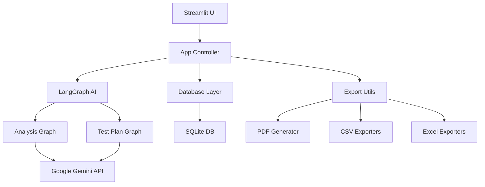

# 🔮 QA Oráculo - Documentação Técnica

Documentação técnica completa do QA Oráculo - Ferramenta de análise inteligente de User Stories.

## 📋 Índice

- [**Visão Geral**](#-visão-geral)
- [**Arquitetura**](#-arquitetura)
- [**Componentes**](#-componentes)
- [**API Reference**](#-api-reference)
- [**Configuração**](#-configuração)
- [**Desenvolvimento**](#-desenvolvimento)
- [**Testes**](#-testes)
- [**Deploy**](#-deploy)

---

## 🎯 Visão Geral

O QA Oráculo é uma ferramenta de análise de User Stories que utiliza Inteligência Artificial para:

- **Analisar** User Stories e identificar ambiguidades
- **Gerar** critérios de aceite estruturados
- **Criar** cenários de teste em formato Gherkin
- **Exportar** para ferramentas de QA (Azure, Jira, Xray)

### 🏗️ Stack Tecnológico

- **Frontend**: Streamlit
- **Backend**: Python 3.11+
- **IA**: Google Gemini (via LangChain)
- **Banco**: SQLite
- **Testes**: Pytest + Coverage
- **Qualidade**: Black + Ruff

---

## 🏗️ Arquitetura



### 🧩 Camadas

1. **Interface (Streamlit)**: UI/UX e interação do usuário
2. **Controller (app.py)**: Lógica de negócio e fluxo
3. **AI Layer (graph.py)**: Processamento com IA
4. **Data Layer (database.py)**: Persistência de dados
5. **Utils (utils.py)**: Utilitários e exportações

---

## 🧩 Componentes

### 📱 Interface (Streamlit)

**Arquivo**: `qa_core/app.py`

**Responsabilidades**:
- Renderização da interface
- Gerenciamento de estado
- Fluxo de análise
- Exportações

**Principais Funções**:
- `render_main_analysis_page()` - Página principal
- `render_history_page()` - Histórico
- `_save_current_analysis_to_history()` - Persistência

### 🤖 IA e Processamento

**Arquivo**: `qa_core/graph.py`

**Responsabilidades**:
- Grafos de análise (LangGraph)
- Integração com Google Gemini
- Processamento de User Stories

**Principais Funções**:
- `grafo_analise` - Análise de User Stories
- `grafo_plano_testes` - Geração de planos de teste

### 💾 Persistência

**Arquivo**: `qa_core/database.py`

**Responsabilidades**:
- Operações SQLite
- Histórico de análises
- CRUD de dados

**Principais Funções**:
- `init_db()` - Inicialização do banco
- `get_all_analysis_history()` - Listar análises
- `delete_analysis_by_id()` - Excluir análise

### 🛠️ Utilitários

**Arquivo**: `qa_core/utils.py`

**Responsabilidades**:
- Exportações (PDF, CSV, Excel)
- Formatação de dados
- Helpers diversos

**Principais Funções**:
- `gerar_csv_azure_from_df()` - Export Azure
- `gerar_csv_xray_from_df()` - Export Xray
- `preparar_df_para_zephyr_xlsx()` - Export Zephyr

### ♿ Acessibilidade

**Arquivo**: `qa_core/a11y.py`

**Responsabilidades**:
- Componentes acessíveis
- Estilos WCAG 2.1
- Navegação por teclado

---

## 🔧 API Reference

### 🎯 Análise de User Stories

```python
def run_analysis_graph(user_story: str) -> dict:
    """
    Executa análise de User Story com IA.
    
    Args:
        user_story: Texto da User Story
        
    Returns:
        dict: {
            'analise_da_us': {...},
            'relatorio_analise_inicial': str
        }
    """
```

### 🧪 Geração de Plano de Testes

```python
def run_test_plan_graph(analysis_state: dict) -> dict:
    """
    Gera plano de testes baseado na análise.
    
    Args:
        analysis_state: Estado da análise
        
    Returns:
        dict: {
            'plano_e_casos_de_teste': {...},
            'relatorio_plano_de_testes': str
        }
    """
```

### 💾 Operações de Banco

```python
def get_all_analysis_history() -> List[dict]:
    """Retorna todas as análises do histórico."""

def delete_analysis_by_id(analysis_id: int) -> bool:
    """Exclui análise específica do histórico."""

def clear_history() -> int:
    """Limpa todo o histórico. Retorna quantidade removida."""
```

---

## ⚙️ Configuração

### 🔑 Variáveis de Ambiente

```bash
# .env
GOOGLE_API_KEY="sua_chave_do_gemini"
```

### 🗄️ Banco de Dados

O SQLite é inicializado automaticamente em `qa_oraculo_history.db`.

**Schema**:
```sql
CREATE TABLE analysis_history (
    id INTEGER PRIMARY KEY,
    created_at TIMESTAMP,
    user_story TEXT,
    analysis_report TEXT,
    test_plan_report TEXT
);
```

### 🎨 Configuração Streamlit

**Arquivo**: `main.py`

```python
st.set_page_config(
    page_title="QA Oráculo",
    layout="wide"
)
```

---

## 🧪 Desenvolvimento

### 🚀 Setup de Desenvolvimento

```bash
# Clone e navegue
git clone https://github.com/seu-usuario/qa-oraculo.git
cd qa-oraculo/qa-oraculo-requisitos

# Setup automático
./quick-setup.sh  # Linux/Mac
quick-setup.bat   # Windows

# Ou manual
python -m venv .venv
source .venv/bin/activate  # Linux/Mac
pip install -r requirements-dev.txt
```

### 🔧 Comandos Úteis

```bash
# Executar aplicação
streamlit run main.py

# Executar testes
pytest

# Testes com cobertura
pytest --cov

# Lint
ruff check .

# Formatação
black .

# Verificar formatação
black --check .
```

### 📝 Padrões de Código

- **Python**: PEP 8 + Black
- **Lint**: Ruff
- **Testes**: Pytest
- **Commits**: Conventional Commits
- **Cobertura**: Mínimo 90%

---

## 🧪 Testes

### 📊 Estrutura de Testes

```
tests/
├── conftest.py              # Fixtures globais
├── test_app.py              # Testes da interface
├── test_database.py         # Testes do banco
├── test_graph.py            # Testes da IA
├── test_utils.py            # Testes de utilitários
├── test_xray_export.py      # Testes Xray
└── test_a11y.py             # Testes acessibilidade
```

### 🎯 Executar Testes

```bash
# Todos os testes
pytest

# Teste específico
pytest tests/test_xray_export.py

# Com cobertura
pytest --cov --cov-report=html

# Verbose
pytest -v
```

### 📈 Cobertura de Testes

- **Mínimo**: 90%
- **Atual**: 97%+
- **CI/CD**: Verificação automática

---

## 🚀 Deploy

### 🏠 Desenvolvimento Local

```bash
streamlit run main.py
```

### 🌐 Produção

```bash
# Instalar dependências
pip install -r requirements.txt

# Configurar variáveis
export GOOGLE_API_KEY="sua_chave"

# Executar
streamlit run main.py --server.port 8501 --server.address 0.0.0.0
```

### 🐳 Docker (Opcional)

```dockerfile
FROM python:3.11-slim

WORKDIR /app
COPY requirements.txt .
RUN pip install -r requirements.txt

COPY . .
EXPOSE 8501

CMD ["streamlit", "run", "main.py", "--server.port=8501", "--server.address=0.0.0.0"]
```

---

## 📚 Documentação Adicional

- [**SETUP_GUIDE.md**](SETUP_GUIDE.md) - Guia de instalação
- [**DEVELOPER_QUICK_START.md**](DEVELOPER_QUICK_START.md) - Setup para devs
- [**XRAY_EXPORT_GUIDE.md**](XRAY_EXPORT_GUIDE.md) - Guia Xray
- [**CHANGELOG.md**](CHANGELOG.md) - Histórico de mudanças

---

## 🤝 Contribuindo

Veja o [**DEVELOPER_QUICK_START.md**](DEVELOPER_QUICK_START.md) para instruções completas de contribuição.

---

**Última atualização**: 2025-10-29