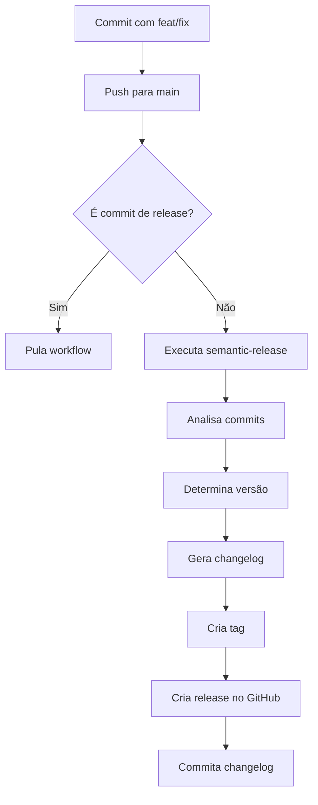

# 🚀 Processo de Release - QA Oráculo

Este documento descreve o processo de release automático do QA Oráculo usando **semantic-release** e **conventional commits**.

## 📋 Índice

- [Visão Geral](#visão-geral)
- [Como Funciona](#como-funciona)
- [Processo Automático](#processo-automático)
- [Release Manual](#release-manual)
- [Troubleshooting](#troubleshooting)
- [Configuração](#configuração)

---

## 🎯 Visão Geral

O QA Oráculo usa **versionamento semântico automático** baseado em **conventional commits**:

- 🤖 **Totalmente automático** - sem intervenção manual
- 📝 **Changelog gerado** automaticamente
- 🏷️ **Tags criadas** automaticamente
- 📦 **Releases no GitHub** criadas automaticamente

### Versionamento Semântico

Formato: `MAJOR.MINOR.PATCH` (ex: `2.1.3`)

- **MAJOR** (2.0.0): Breaking changes (mudanças incompatíveis)
- **MINOR** (1.1.0): Novas funcionalidades (compatíveis)
- **PATCH** (1.0.1): Correções de bugs

---

## ⚙️ Como Funciona

### 1. Desenvolvedor Faz Commit

```bash
git commit -m "feat: adicionar exportação para Cucumber"
```

### 2. Abre Pull Request

```bash
git push origin feat/cucumber-export
# Abrir PR no GitHub
```

### 3. PR é Aprovado e Mergeado

```bash
# Merge para main via GitHub UI
```

### 4. Workflow de Release é Acionado

O workflow `.github/workflows/release.yml` é executado automaticamente.

### 5. Semantic Release Analisa Commits

```bash
# Analisa commits desde a última release
# Determina tipo de release (major/minor/patch)
```

### 6. Versão é Incrementada

```
feat: → MINOR (1.0.0 → 1.1.0)
fix:  → PATCH (1.0.0 → 1.0.1)
feat!: → MAJOR (1.0.0 → 2.0.0)
```

### 7. Changelog é Atualizado

Arquivo `docs/RELEASE_NOTES.md` é atualizado automaticamente.

### 8. Tag e Release são Criadas

- Tag Git: `v1.1.0`
- Release no GitHub com changelog

### 9. Changelog é Commitado

```bash
chore(release): 1.1.0 [skip ci]
```

---

## 🔄 Processo Automático

### Gatilhos

O workflow de release é acionado quando:

1. **Push para `main`** (após merge de PR)
2. **Manualmente** via GitHub Actions UI

### Condições

O release **NÃO** acontece se:

- ❌ Commit é de release anterior (`chore(release):`)
- ❌ Nenhum commit relevante desde última release
- ❌ Apenas commits de `docs`, `chore`, `style`, etc.

### Fluxo Completo



---

## 🛠️ Release Manual

### Quando Fazer Release Manual?

- 🚨 Workflow automático falhou
- 🔧 Precisa forçar uma versão específica
- 🧪 Teste de release em branch de desenvolvimento

### Opção 1: Via GitHub Actions UI

1. Vá em **Actions** → **Release**
2. Clique em **Run workflow**
3. Selecione branch `main`
4. Escolha tipo de release (opcional):
   - `auto` - Determina automaticamente
   - `major` - Força MAJOR (1.0.0 → 2.0.0)
   - `minor` - Força MINOR (1.0.0 → 1.1.0)
   - `patch` - Força PATCH (1.0.0 → 1.0.1)
5. Clique em **Run workflow**

### Opção 2: Via CLI Local

```bash
# 1. Certifique-se de estar na main atualizada
git checkout main
git pull origin main

# 2. Instale semantic-release
npm install -g semantic-release @semantic-release/changelog @semantic-release/git @semantic-release/github conventional-changelog-conventionalcommits

# 3. Configure variável de ambiente
export GITHUB_TOKEN=seu_token_aqui

# 4. Execute semantic-release
npx semantic-release
```

### Opção 3: Release Manual Completa

Se semantic-release não funcionar:

```bash
# 1. Determine a próxima versão
# Veja commits desde última tag
git log $(git describe --tags --abbrev=0)..HEAD --oneline

# 2. Atualize RELEASE_NOTES.md manualmente
# Adicione seção com a nova versão

# 3. Crie tag
git tag -a v1.2.0 -m "Release 1.2.0"

# 4. Push da tag
git push origin v1.2.0

# 5. Crie release no GitHub UI
# Vá em Releases → Draft a new release
# Selecione a tag v1.2.0
# Copie conteúdo do RELEASE_NOTES.md
# Publique
```

---

## 🐛 Troubleshooting

### Workflow não foi acionado

**Problema**: Push para main não acionou workflow

**Soluções**:
1. Verifique se o commit não é de release (`chore(release):`)
2. Verifique se há commits relevantes (`feat`, `fix`, etc.)
3. Verifique logs do GitHub Actions
4. Execute manualmente via UI

### Erro: "No release published"

**Problema**: Semantic release não publicou release

**Causas comuns**:
- Apenas commits de `docs`, `chore`, `style`
- Nenhum commit desde última release
- Commits não seguem conventional commits

**Solução**:
```bash
# Verifique commits desde última tag
git log $(git describe --tags --abbrev=0)..HEAD --oneline --grep="^feat" --grep="^fix" -E

# Se não houver commits relevantes, faça um:
git commit --allow-empty -m "chore: trigger release"
git push origin main
```

### Erro: "GITHUB_TOKEN permissions"

**Problema**: Token não tem permissões suficientes

**Solução**:
1. Vá em **Settings** → **Actions** → **General**
2. Em **Workflow permissions**, selecione:
   - ✅ Read and write permissions
   - ✅ Allow GitHub Actions to create and approve pull requests
3. Salve

### Versão errada foi gerada

**Problema**: Esperava MINOR mas gerou PATCH

**Causa**: Tipo de commit incorreto

**Solução**:
```bash
# Verifique o tipo do commit
git log -1 --oneline

# Se estiver errado, faça um novo commit corrigindo
git commit --allow-empty -m "feat: força release minor"
git push origin main
```

### Changelog não foi atualizado

**Problema**: `RELEASE_NOTES.md` não foi modificado

**Soluções**:
1. Verifique se arquivo existe em `docs/RELEASE_NOTES.md`
2. Verifique configuração em `.releaserc.json`
3. Verifique logs do workflow
4. Atualize manualmente se necessário

### Tag já existe

**Problema**: "Tag v1.2.0 already exists"

**Solução**:
```bash
# Opção 1: Deletar tag local e remota
git tag -d v1.2.0
git push origin :refs/tags/v1.2.0

# Opção 2: Incrementar versão manualmente
# Faça um commit adicional e tente novamente
```

---

## 🔧 Configuração

### Arquivos Importantes

1. **`.releaserc.json`** - Configuração do semantic-release
2. **`.github/workflows/release.yml`** - Workflow de release
3. **`docs/RELEASE_NOTES.md`** - Changelog gerado

### Estrutura do `.releaserc.json`

```json
{
  "branches": ["main"],
  "plugins": [
    "@semantic-release/commit-analyzer",
    "@semantic-release/release-notes-generator",
    "@semantic-release/changelog",
    "@semantic-release/github",
    "@semantic-release/git"
  ]
}
```

### Regras de Release

Definidas em `.releaserc.json`:

```json
"releaseRules": [
  {"type": "feat", "release": "minor"},
  {"type": "fix", "release": "patch"},
  {"type": "perf", "release": "patch"},
  {"type": "revert", "release": "patch"},
  {"type": "refactor", "release": "patch"},
  {"type": "docs", "release": false},
  {"type": "style", "release": false},
  {"type": "chore", "release": false},
  {"type": "test", "release": false"}
]
```

### Customizar Mensagens de Release

Edite `.releaserc.json`:

```json
{
  "preset": "conventionalcommits",
  "presetConfig": {
    "types": [
      {"type": "feat", "section": "✨ Novas Funcionalidades"},
      {"type": "fix", "section": "🐛 Correções de Bugs"},
      {"type": "perf", "section": "⚡ Melhorias de Performance"}
    ]
  }
}
```

---

## 📊 Monitoramento de Releases

### Ver Últimas Releases

```bash
# Via Git
git tag -l --sort=-v:refname | head -5

# Via GitHub CLI
gh release list --limit 5
```

### Ver Changelog de uma Release

```bash
# Via Git
git show v1.2.0

# Via GitHub CLI
gh release view v1.2.0
```

### Estatísticas de Releases

```bash
# Número total de releases
git tag | wc -l

# Releases nos últimos 30 dias
git tag --sort=-creatordate --format='%(creatordate:short) %(refname:short)' | head -10
```

---

## 📚 Recursos Adicionais

- [Semantic Release Documentation](https://semantic-release.gitbook.io/)
- [Conventional Commits](https://www.conventionalcommits.org/)
- [Semantic Versioning](https://semver.org/)
- [GitHub Actions Documentation](https://docs.github.com/en/actions)

---

## ✅ Checklist de Release

Antes de fazer release importante:

- [ ] Todos os testes passando
- [ ] Cobertura > 90%
- [ ] Linters sem erros
- [ ] Documentação atualizada
- [ ] CHANGELOG revisado
- [ ] Breaking changes documentadas
- [ ] Commits seguem conventional commits
- [ ] PR aprovado e mergeado

---

**Última atualização**: Novembro 2025
